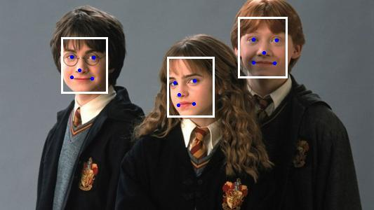

# MTCNN 人脸检测项目

基于MTCNN的人脸检测项目，包含 Python 实现和 C++ 实现，支持 ONNX 推理加速。

## 项目简介

MTCNN 是一种基于深度学习的人脸检测算法，通过级联三个卷积神经网络（P-Net、R-Net、O-Net）实现高效的人脸检测和关键点定位。本项目提供了：

- **Python 版本**：完整的 MTCNN 实现，支持图像检测和摄像头实时检测
- **C++ 版本**：基于 ONNX Runtime 的高性能推理实现
- **模型导出**：支持将 PyTorch 模型导出为 ONNX 格式

## 检测效果

| 原始图像 | 检测结果 |
| :--- | :--- |
|  |  |

## 目录结构

```
pj_mtcnn/
├── py/                    # Python MTCNN 实现
│   ├── demo.py            # 图像人脸检测演示
│   ├── camera_demo.py     # 摄像头实时人脸检测
│   ├── images/            # 测试图像目录
│   │   ├── image.jpg      # 原始测试图像
│   │   └── drawed_image.jpg # 检测结果图像
│   └── mtcnn/             # MTCNN 核心模块
│       ├── __init__.py    # 模块初始化
│       ├── detector.py    # 人脸检测器主类
│       ├── get_nets.py    # P-Net/R-Net/O-Net 模型定义
│       ├── export_net.py  # ONNX 模型导出脚本
│       ├── utils.py       # 工具函数
│       ├── weights/       # NPY 格式预训练权重
│       │   ├── pnet.npy
│       │   ├── rnet.npy
│       │   └── onet.npy
│       └── onnx/          # 导出的 ONNX 模型
│           ├── pnet.onnx
│           ├── rnet.onnx
│           └── onet.onnx
├── cpp/                   # C++ MTCNN 实现
│   ├── main.cpp           # 主程序入口
│   ├── mtcnn.cpp          # MTCNN 核心实现
│   ├── mtcnn.h            # MTCNN 头文件
│   ├── image.jpg          # 测试图像
│   ├── onnx/              # ONNX 模型目录
│   │   ├── pnet.onnx
│   │   ├── rnet.onnx
│   │   └── onet.onnx
│   ├── onnxruntime-win-x64-gpu-1.18.0 / onnxruntime-win-x64-gpu-1.18.0 /  # ONNX Runtime 依赖
│   │   ├── include/        # 头文件目录
│   │   └── lib/            # 库文件目录
│   └── x64/               # 编译输出目录
│       └── Release/
├── config_imgs/           # VS2022 配置截图
│   ├── 1.jpg
│   ├── 2.jpg
│   ├── 3.jpg
│   └── 4.jpg
└── README.md              # 项目说明文档
```

## 文件功能说明

### Python 模块

| 文件 | 功能描述 |
| :--- | :--- |
| `py/demo.py` | 图像人脸检测演示脚本，加载图像并检测人脸，绘制边界框和关键点 |
| `py/camera_demo.py` | 摄像头实时人脸检测，使用 OpenCV 读取摄像头并实时显示检测结果 |
| `py/mtcnn/detector.py` | FaceDetector 类，提供人脸检测、绘制、裁剪等接口 |
| `py/mtcnn/get_nets.py` | P-Net、R-Net、O-Net 三个神经网络的 PyTorch 定义 |
| `py/mtcnn/export_net.py` | 将 PyTorch 模型导出为 ONNX 格式的脚本 |
| `py/mtcnn/utils.py` | 辅助工具函数（非极大值抑制、边界框处理等） |

### C++ 模块

| 文件 | 功能描述 |
| :--- | :--- |
| `cpp/main.cpp` | C++ 主程序，演示图像人脸检测流程 |
| `cpp/mtcnn.cpp` | MTCNN 算法的 C++ 实现，调用 ONNX Runtime 进行推理 |
| `cpp/mtcnn.h` | MTCNN 类的头文件声明 |
| `cpp/onnxruntime-win-x64-gpu-1.18.0/` | ONNX Runtime GPU 版本的头文件和库文件，本项目搭配了OpenCV 4.4.0版本 |

### 模型文件

| 文件 | 描述 |
| :--- | :--- |
| `pnet.npy / pnet.onnx` | P-Net 模型，快速生成人脸候选框 |
| `rnet.npy / rnet.onnx` | R-Net 模型，过滤误检候选框 |
| `onet.npy / onet.onnx` | O-Net 模型，精确人脸检测和关键点定位 |

## MTCNN 算法原理

MTCNN 采用三级级联结构：

1. **P-Net（Proposal Network）**：快速生成大量人脸候选框
2. **R-Net（Refine Network）**：对候选框进行精细筛选
3. **O-Net（Output Network）**：输出最终人脸边界框和5个关键点（左眼、右眼、鼻子、左嘴角、右嘴角）

### 输出格式

- **边界框（bbox）**：`[x1, y1, x2, y2, score]`，左上角和右下角坐标及置信度
- **关键点（landmark）**：`[right_eye_x, left_eye_x, nose_x, right_mouth_x, left_mouth_x, right_eye_y, left_eye_y, nose_y, right_mouth_y, left_mouth_y]`

## Python 版本使用

### 图像人脸检测

```python
from mtcnn import FaceDetector
from PIL import Image

detector = FaceDetector()
image = Image.open("./images/image.jpg")

# 检测人脸
bboxes, landmarks = detector.detect(image)

# 绘制并保存结果
drawed_image = detector.draw_bboxes(image)
drawed_image.save("./images/drawed_image.jpg")
```

### 摄像头实时检测

```python
python camera_demo.py
```

## C++ 版本 VS2022 配置

### 环境要求

- Visual Studio 2022
- ONNX Runtime GPU 版本 1.18.0（include和lib目录结构包含在项目中，但是需要手动下载并解压）
- OpenCV 4.4.0 版本（需自行配置）

### 配置步骤

`config_imgs/` 目录包含了相关的 VS2022 配置步骤截图：

| 截图 | 说明 |
| :--- | :--- |
|  | 头文件搜索目录 |
|  | 库文件搜索目录 |
|  | 链接的库 |
|  | 编译后需要将对应的三个dll文件复制到可执行文件所在目录，不然会报错。 |

## 模型导出

如需重新导出 ONNX 模型：

```python
from mtcnn.export_net import export_onnx

export_onnx()  # 导出所有模型到 ./mtcnn/onnx/
```

## 依赖

### Python 依赖
使用时根据情况调整，项目能运行即可。

### C++ 依赖

- onnxruntime-win-x64-gpu-1.18.0，下载链接：[ONNX Runtime GPU 版本 1.18.0](https://github.com/microsoft/onnxruntime/releases/tag/v1.18.0)
- OpenCV 4.4.0 版本（需自行配置），下载链接：[OpenCV 4.4.0 下载](https://github.com/opencv/opencv/releases/tag/4.4.0)，或 [OpenCV官方下载](https://opencv.org/releases)。

## 许可证

本项目仅供学习和研究使用。
